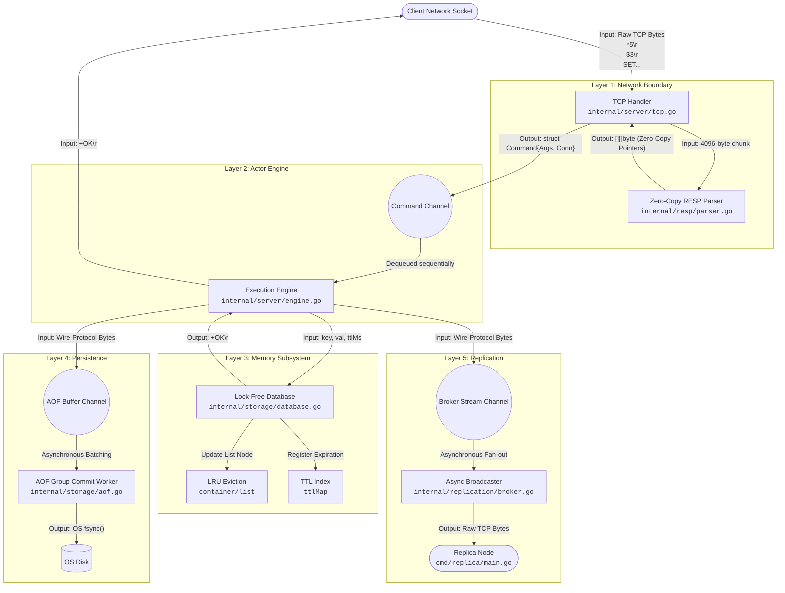

# Execution Flow Architecture

This document illustrates the lifecycle of a complex command as it traverses the lock-free architecture. 

## Scenario: A Mutating Command with Expiration
**Command:** `SET session:123 "active" EX 3600`
**Goal:** The client sends a TCP packet to create a key with a 1-hour Time-To-Live (TTL). The master node must parse it without allocations, execute it lock-free, persist it to disk asynchronously, and fan it out to Replicas.

---

### End-to-End Execution Graph

### Step-by-Step State Transitions

#### 1. Network Ingestion (`internal/server/tcp.go`)
- **Input:** Fragments of a TCP packet: `*5\r\n$3\r\nSET\r\n$11\r\nsession:123\r\n$6\r\nactive\r\n$2\r\nEX\r\n$4\r\n3600\r\n`
- **Action:** The TCP Goroutine reads the bytes into a pre-allocated buffer and passes the buffer slice to the Parser.

#### 2. Zero-Copy Parsing (`internal/resp/parser.go`)
- **Input:** `[]byte` (The network buffer segment).
- **Action:** The parser uses byte arithmetic to identify the boundaries of the strings. It does not allocate new memory.
- **Output:** `[][]byte` (A 2D array of pointers referencing the original buffer). Returns `ErrIncomplete` if the packet is fragmented.

#### 3. Channel Routing
- **Input:** The `[][]byte` slice.
- **Action:** Packaged into a `Command` struct containing the Client's `net.Conn` and `RespondCh`. Pushed into the `100,000` capacity buffered channel.
- **Output:** The TCP Goroutine instantly loops back to listen for more network traffic.

#### 4. Actor Engine Execution (`internal/server/engine.go`)
- **Input:** `Command` struct dequeued from the channel.
- **Action:** The single-threaded Engine evaluates `SET`. Because it is the only thread running, it does not acquire a `sync.RWMutex`.
- **Output:** The Engine calculates `ttlMs = 3600000` and passes the arguments to the Memory Subsystem.

#### 5. Memory Subsystem Mutation (`internal/storage/database.go`)
- **Input:** `key = "session:123"`, `val = "active"`, `ttlMs = 3600000`.
- **Action:** 
  1. Instantiates a universal `Object` struct.
  2. Updates `usedMemory` based on byte length.
  3. Pushes the key to the front of the `LRU Doubly Linked List`.
  4. Registers the key in the `ttlMap` for the Active Expiration Cron loop.
- **Output:** `true` (Mutation successful). The Engine pushes `+OK\r\n` to the client's `RespondCh`.

#### 6. Asynchronous Persistence (`internal/storage/aof.go`)
- **Input:** Reconstructed RESP bytes of the `SET` command.
- **Action:** Pushed to the AOF non-blocking channel. The background `groupCommitWorker` receives it, writes to a 64KB buffer, and executes a hardware `fsync()` exactly once per second.
- **Output:** Appended to `database.aof` on disk.

#### 7. Asynchronous Replication (`internal/replication/broker.go`)
- **Input:** Reconstructed RESP bytes of the `SET` command.
- **Action:** Pushed to the Broker non-blocking channel. The background `broadcasterWorker` iterates over all connected replica sockets and streams the bytes.
- **Output:** The Replica node (`cmd/replica/main.go`) receives the exact TCP bytes and mirrors the state execution locally.
